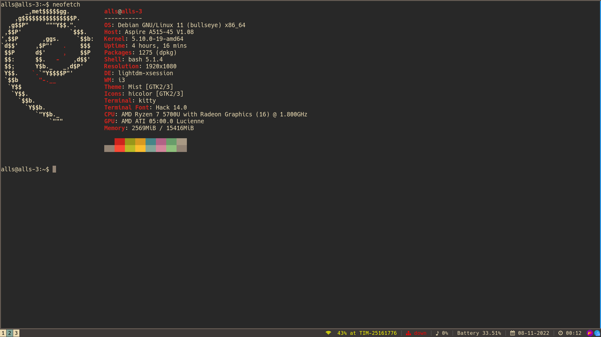

# .config
This repo contains config files so that they're backuped and can be shared across multiple devices.



* For kitty's colorscheme https://github.com/dexpota/kitty-themes

* For configure LSP in neovim with Mason https://www.youtube.com/watch?v=2iczAXDdgTE

* For powermenu and with Rofi https://www.youtube.com/watch?v=v8w1i3wAKiw&t=439s

* For the notification of low battery, on terminal
```
crontab -e
```
and append
```
*/5 * * * * DISPLAY=:0 DBUS_SESSION_BUS_ADDRESS=unix:path=/run/user/1000/bus setpriv --euid=1000 /home/alls/scripts/battery.sh
```
substitute alls and 1000 respectively with user's name and UID, you can get it with
```
alls@alls-3:~$ id
uid=1000(alls) gid=1000(alls) groups=1000(alls),24(cdrom),25(floppy),27(sudo),29(audio),30(dip),44(video),46(plugdev),108(netdev),112(bluetooth)
```
