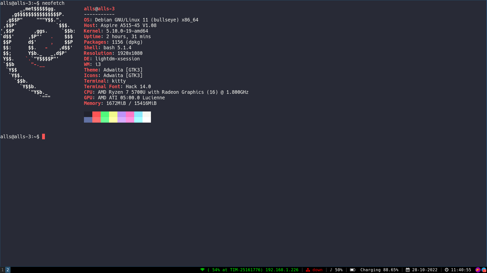

# .config
This repo contains config files so that they're backuped and can be shared across multiple devices.

For kitty's colorscheme https://github.com/dexpota/kitty-themes

For configure LSP in neovim with Mason https://www.youtube.com/watch?v=2iczAXDdgTE
